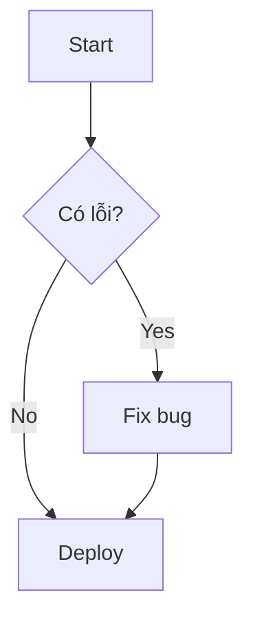
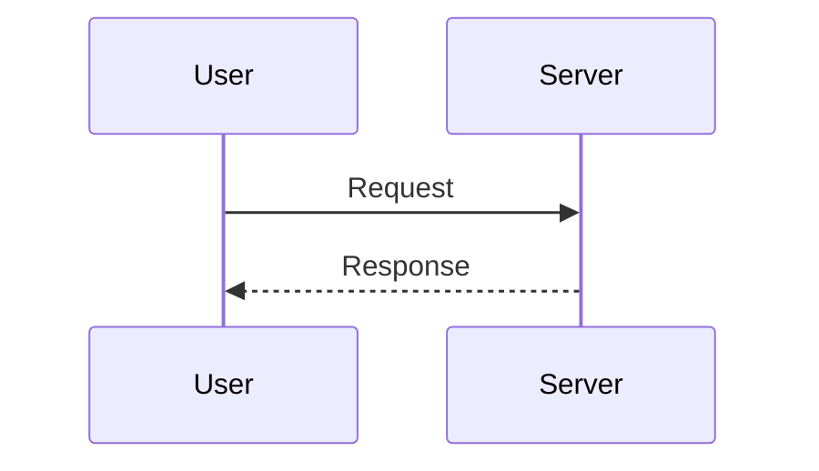
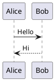

# Ví dụ Mermaid

```mermaid
graph TD
    A[Start] --> B{Có lỗi?}
    B -->|Yes| C[Fix bug]
    B -->|No| D[Deploy]
    C --> D
```

# Ví dụ sequence diagram Mermaid

```mermaid
sequenceDiagram
    participant User
    participant Server

    User->>Server: Request
    Server-->>User: Response
```

# Ví dụ PlantUML

```plantuml
@startuml
Alice -> Bob: Hello
Bob --> Alice: Hi
@enduml
```

