# NixOS Configuration

A modular and reusable configuration for [NixOS](https://nixos.org/), designed to manage the operating system and user environment declaratively.

The project separates **machine-specific configuration**, **system configuration**, **user configuration**, and **shared setup** into independent layers.

The main goal is to make the configuration easier to maintain, reuse, extend, and migrate between machines.

---

## Overview

The configuration follows a modular architecture in which the original NixOS installation is kept separately from the reusable configuration.

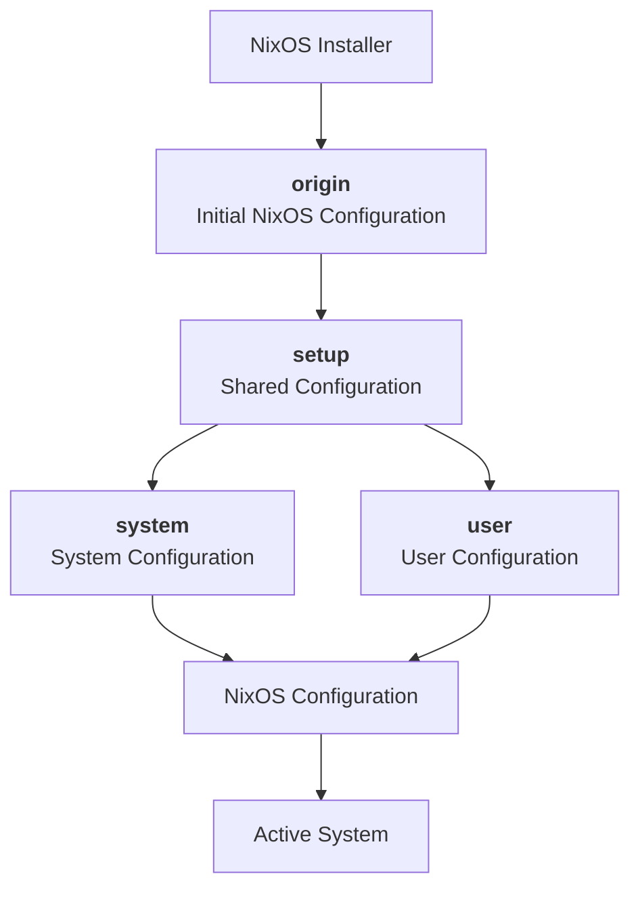

The main architectural layers are:

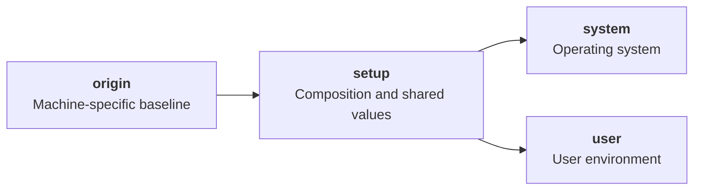

---

# Repository Structure

```text
.
├── nixos/
│   │
│   ├── automation/
│   │   └── origin/
│   │       ├── configuration.nix
│   │       └── hardware-configuration.nix
│   │
│   ├── system/
│   │   ├── personal/
│   │   │   ├── working/
│   │   │   │   ├── development/
│   │   │   │   │   ├── languages/
│   │   │   │   │   │   ├── lua.nix
│   │   │   │   │   │   ├── markdown.nix
│   │   │   │   │   │   ├── nix.nix
│   │   │   │   │   │   ├── python.nix
│   │   │   │   │   │   ├── qt.nix
│   │   │   │   │   │   ├── ruby.nix
│   │   │   │   │   │   ├── rust.nix
│   │   │   │   │   │   ├── solidity.nix
│   │   │   │   │   │   ├── sql.nix
│   │   │   │   │   │   ├── web.nix
│   │   │   │   │   │   └── yaml.nix
│   │   │   │   │   │
│   │   │   │   │   ├── tools/
│   │   │   │   │   │   ├── manager.nix
│   │   │   │   │   │   ├── support.nix
│   │   │   │   │   │   └── tools.nix
│   │   │   │   │   │
│   │   │   │   │   └── development.nix
│   │   │   │   │
│   │   │   │   └── working.nix
│   │   │   │
│   │   │   └── personal.nix
│   │   │
│   │   ├── presets/
│   │   │   └── presets.nix
│   │   │
│   │   └── system.nix
│   │
│   └── user/
│       ├── environment/
│       │   ├── aliases.nix
│       │   ├── cloud.nix
│       │   ├── environment.nix
│       │   └── shell.nix
│       │
│       ├── storage/
│       │   ├── dotfiles/
│       │   │   ├── cava/
│       │   │   ├── fastfetch/
│       │   │   ├── hypr/
│       │   │   ├── nvim/
│       │   │   ├── swappy/
│       │   │   ├── wezterm/
│       │   │   ├── yazi/
│       │   │   ├── zathura/
│       │   │   └── starship.toml
│       │   │
│       │   ├── wallpapers/
│       │   └── storage.nix
│       │
│       ├── style.nix
│       └── user.nix
│
├── setup/
│   ├── shared.nix
│   ├── system.nix
│   └── user.nix
│
├── LICENSE
└── README.md
```

> The exact contents of individual modules may change over time. The important architectural boundaries are `origin`, `system`, `user`, and `setup`.

---

# Directory Responsibilities

## `nixos/automation/origin`

The `origin` directory contains the configuration generated by the NixOS installer.

A fresh NixOS installation normally provides:

```text
/etc/nixos/
├── configuration.nix
└── hardware-configuration.nix
```

The entire directory is copied into the project and becomes:

```text
nixos/automation/origin/
├── configuration.nix
└── hardware-configuration.nix
```

The purpose of `origin` is to preserve the machine-specific baseline independently from the reusable configuration.

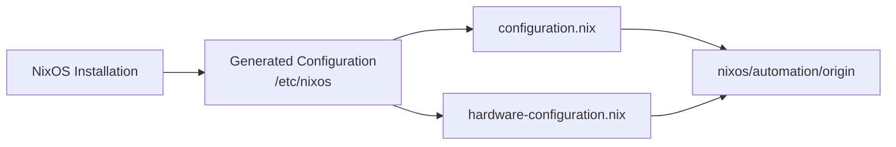

The `origin` directory is expected to be specific to the machine on which NixOS was installed.

---

# `nixos/system`

The `system` directory contains system-level NixOS configuration.

```text
nixos/system/
├── personal/
├── presets/
└── system.nix
```

This layer describes the desired state of the operating system.

It can contain configuration for:

- system packages
- services
- hardware
- networking
- security
- development environments
- system-wide applications
- other NixOS options

The configuration is divided into modules so individual components can be maintained independently.

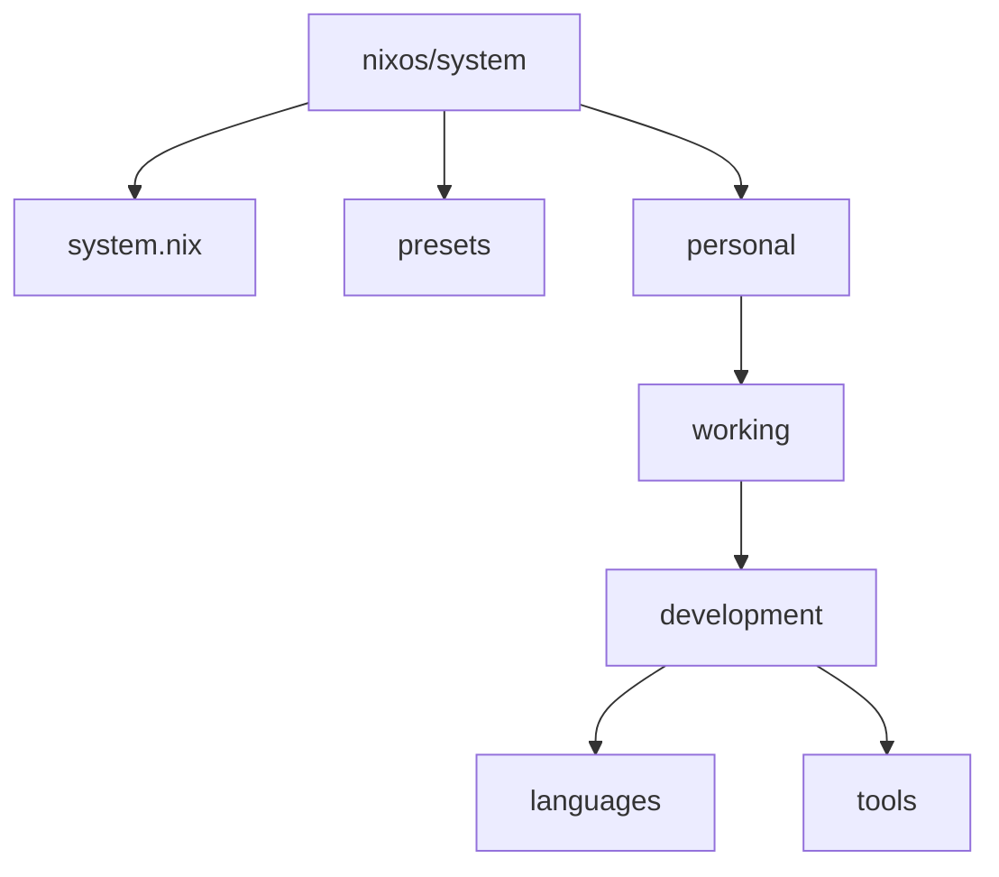

---

# `nixos/user`

The `user` directory contains user-level configuration.

```text
nixos/user/
├── environment/
├── storage/
├── style.nix
└── user.nix
```

The user layer is intentionally separated from the system layer.

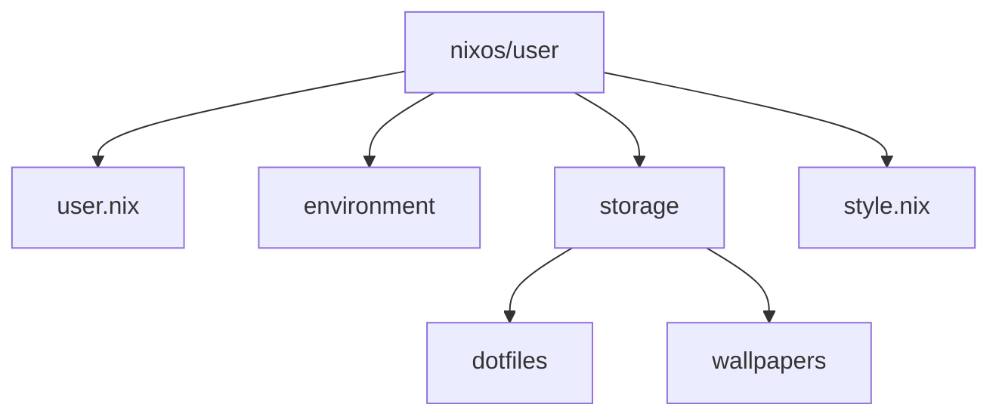

### Environment

The `environment` directory contains configuration related to the user's environment.

This may include:

- shell configuration
- aliases
- environment variables
- session configuration
- user-specific utilities

### Storage

The `storage` directory contains persistent user resources.

This can include:

- application configuration
- dotfiles
- wallpapers
- other user-owned resources

### Style

`style.nix` contains configuration related to the visual appearance of the user environment.

---

# `setup`

The `setup` directory acts as the composition layer of the project.

```text
setup/
├── shared.nix
├── system.nix
└── user.nix
```

It connects shared values with the system and user configuration.

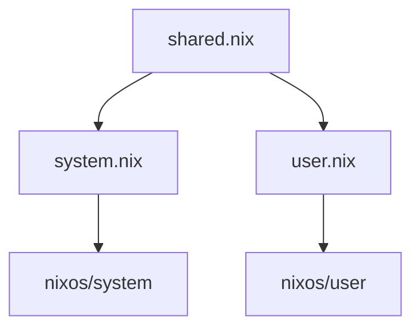

## `shared.nix`

`shared.nix` contains values and helper functions shared between different parts of the configuration.

It can centralize machine-dependent information such as:

```text
Current user
System architecture
Supported systems
System-specific options
Shared helper functions
```

Centralizing these values avoids repeating machine-specific information throughout individual modules.

---

# Configuration Flow

The complete configuration flow can be represented as:

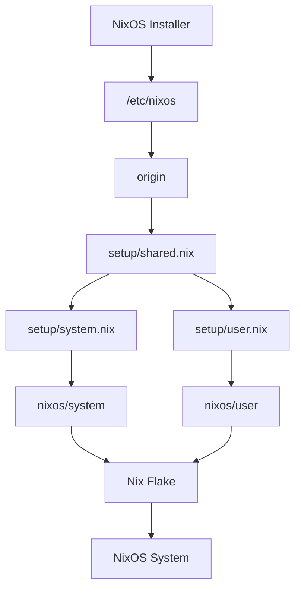

This separation provides a clear distinction between:

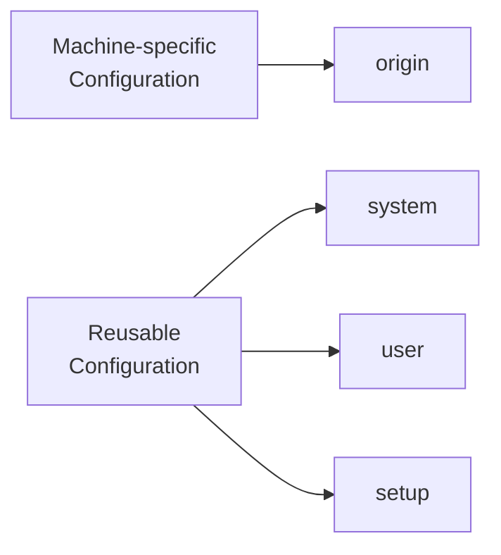

---

# Installation

## 1. Install NixOS

Install NixOS normally using the official installer.

After installation, NixOS generates:

```text
/etc/nixos/
├── configuration.nix
└── hardware-configuration.nix
```

Keep this directory because it will become the machine-specific `origin`.

## 2. Clone the Repository

Clone this repository:

```bash
git clone <repository-url>
cd <repository-directory>
```

## 3. Copy the Original Configuration

Copy the entire NixOS configuration directory into the project's automation directory:

```bash
cp -r /etc/nixos nixos/automation/origin
```

The resulting structure should be:

```text
nixos/
└── automation/
    └── origin/
        ├── configuration.nix
        └── hardware-configuration.nix
```

Both files should be copied together.

## 4. Configure Machine-Specific Values

Open:

```text
setup/shared.nix
```

Adjust the values required by the target machine.

Typical values include:

- username
- system architecture
- supported architectures
- hardware-dependent options

The values should match the machine on which the configuration will be deployed.

## 5. Enable Nix Flakes

This project uses Nix Flakes.

Enable:

```nix
nix.settings.experimental-features = [
  "nix-command"
  "flakes"
];
```

Flakes can also be enabled temporarily:

```bash
nix --extra-experimental-features "nix-command flakes" <command>
```

## 6. Check the Configuration

Before applying the configuration:

```bash
nix flake check
```

## 7. Apply the Configuration

Build and activate the configuration:

```bash
sudo nixos-rebuild switch --flake .
```

If multiple configurations are provided:

```bash
sudo nixos-rebuild switch --flake .#<configuration>
```

---

# Reusability

The configuration is designed to separate machine-specific information from reusable modules.

A new machine can therefore follow the same process:

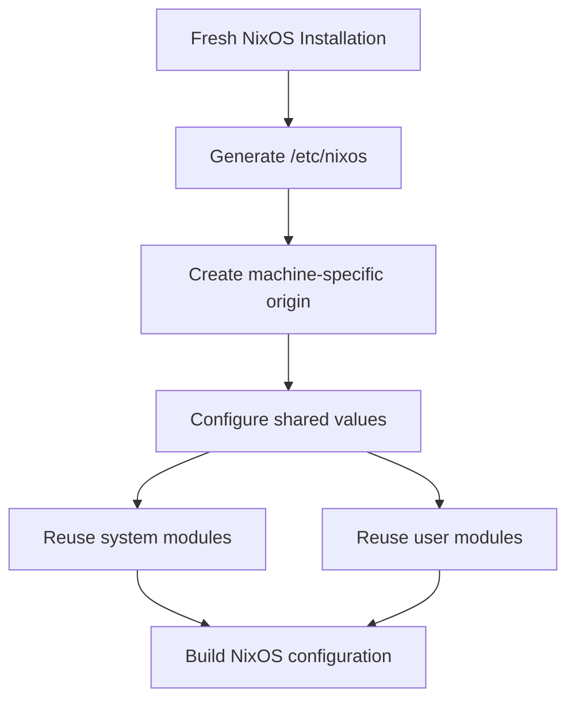

Different machines can have different `origin` configurations while sharing the same reusable modules:

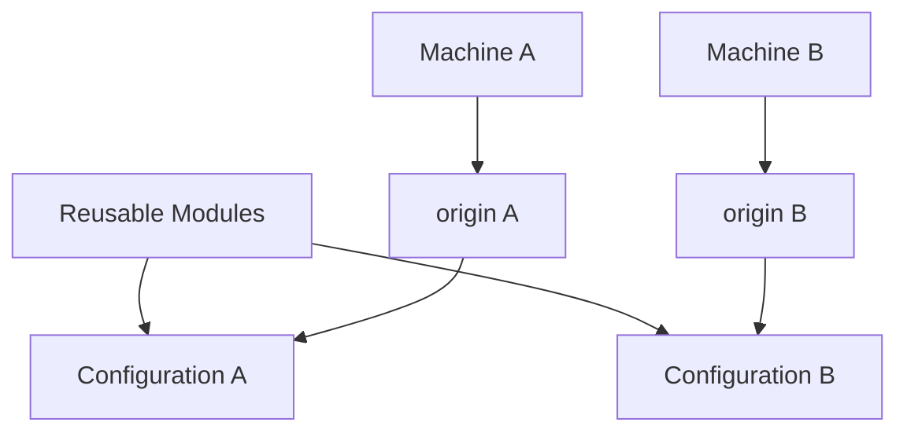

---

# Features

## Declarative Configuration

The desired state of the system is described using Nix expressions.

System configuration, user configuration, and application configuration can be managed as code.

## Modular Architecture

Configuration is divided into smaller modules based on responsibility.

This makes individual components easier to:

- maintain
- extend
- replace
- disable
- reuse

## Machine-Specific Isolation

Machine-specific configuration is isolated inside `origin`.

Reusable modules do not need to contain the hardware configuration generated for a particular installation.

## Multi-System Support

The configuration can define support for multiple system architectures.

Architecture-specific settings can be centralized rather than duplicated throughout individual modules.

## System and User Separation

System-level and user-level configuration are maintained independently.

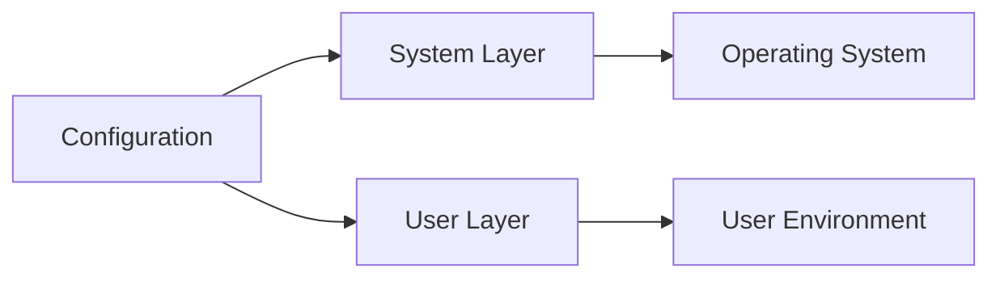

## Development Modules

Development environments can be organized into independent modules.

Languages, frameworks, tools, and other development components can be maintained separately.

## Application Configuration

Application configuration can be stored together with the NixOS configuration.

This allows the user environment to be version-controlled and reconstructed alongside the operating system.

## Reproducibility

A new NixOS installation can use its generated configuration as the machine-specific baseline while reusing the project's modular configuration.

## Version Control

The configuration is designed to be maintained in Git.

Changes can be reviewed, tracked, reverted, and shared like a software project.

---

# Updating

Check the flake after modifying the configuration:

```bash
nix flake check
```

Build the configuration without activating it:

```bash
sudo nixos-rebuild build --flake .
```

Apply the configuration:

```bash
sudo nixos-rebuild switch --flake .
```

---

# Rollback

NixOS maintains previous system generations.

If a configuration change causes a problem, a previous generation can be selected from the bootloader.

A rollback can also be performed with:

```bash
sudo nixos-rebuild switch --rollback
```

---

# Design Principles

The project is built around four principles:

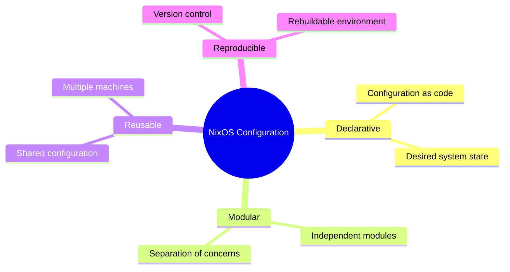

### Declarative

Describe the desired state of the system instead of manually performing configuration steps.

### Modular

Keep unrelated configuration in separate modules.

### Reusable

Separate machine-specific values from configuration that can be shared across installations.

### Reproducible

Keep the configuration in version control so the environment can be rebuilt consistently.

# workflow

## Neovim

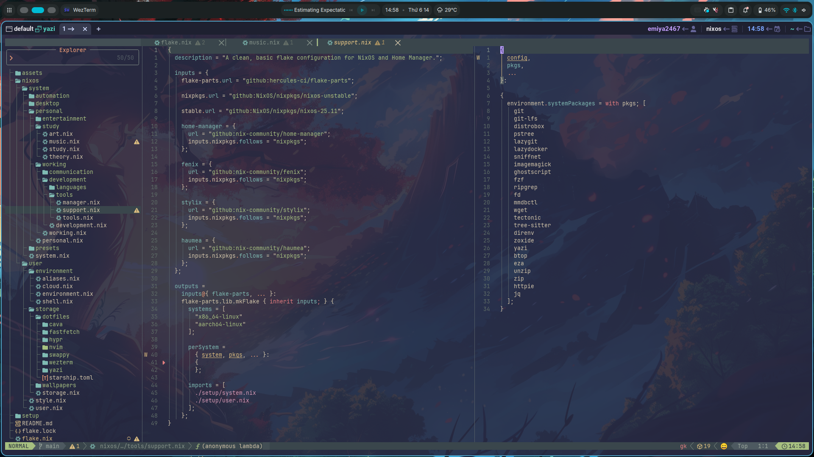


## Niri


---

# License

See [`LICENSE`](LICENSE) for the license of this project.
