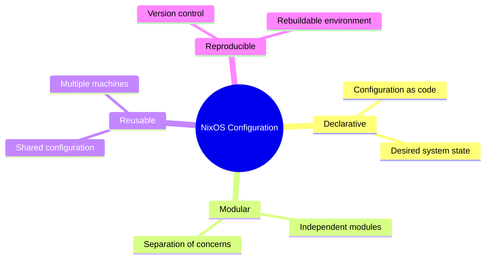
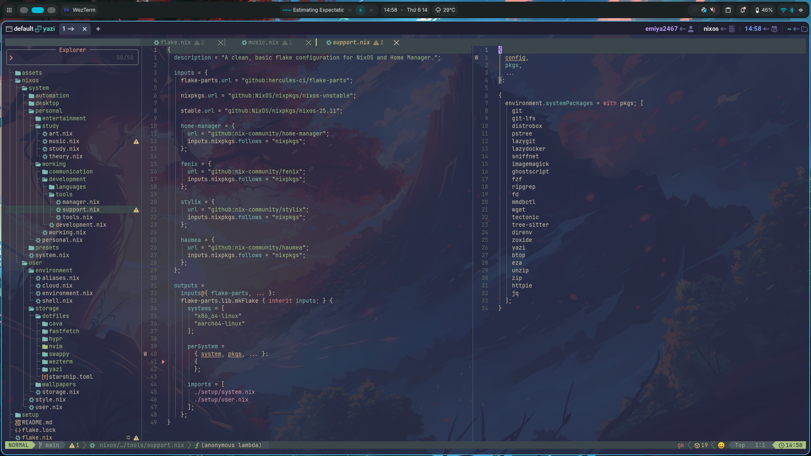
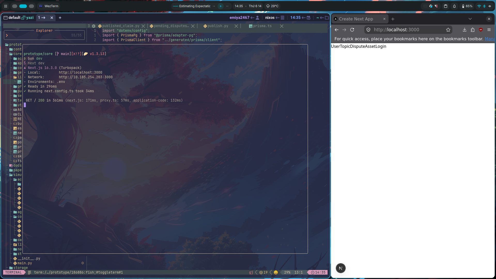
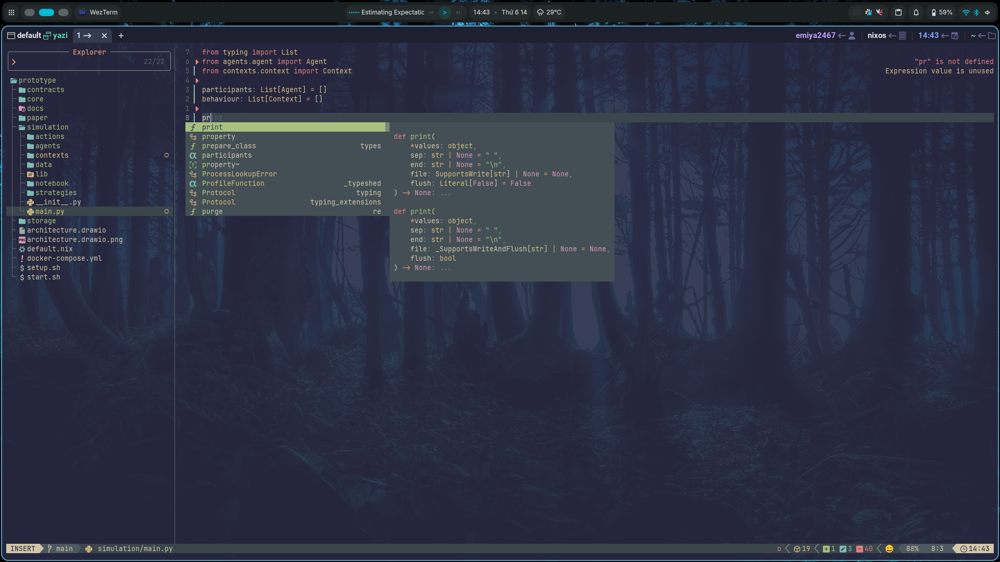
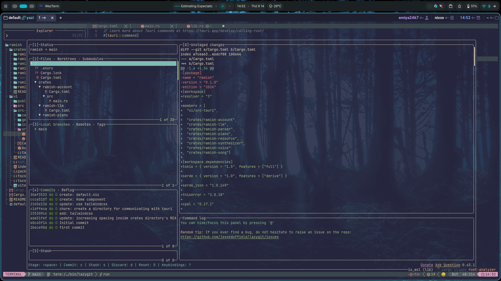
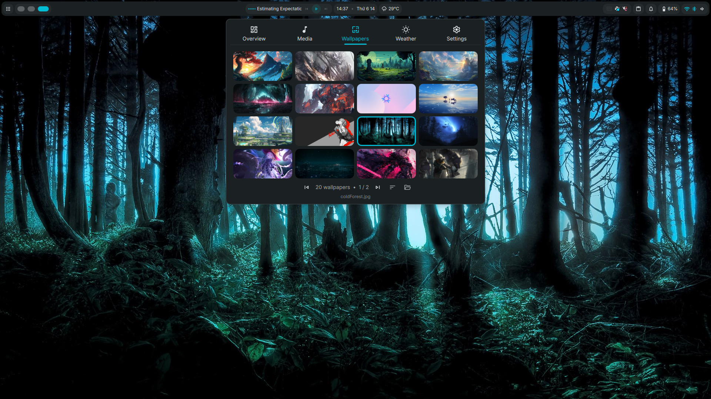
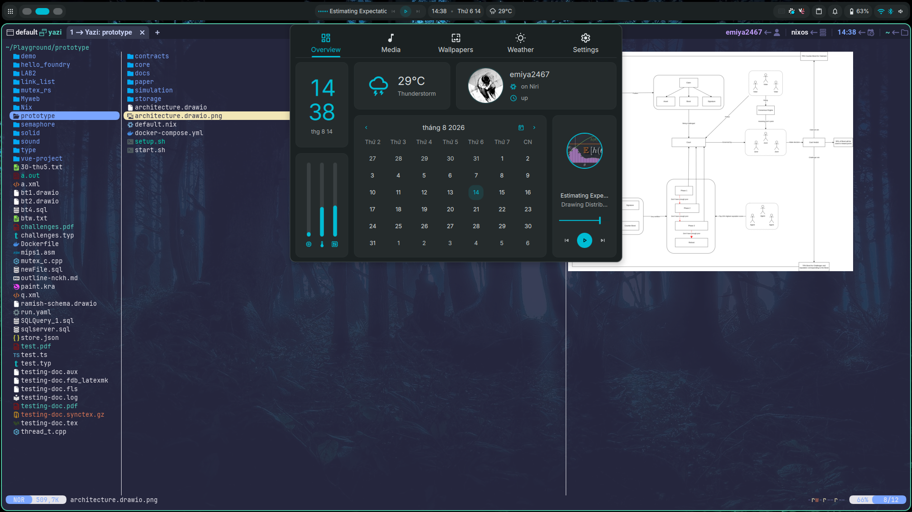
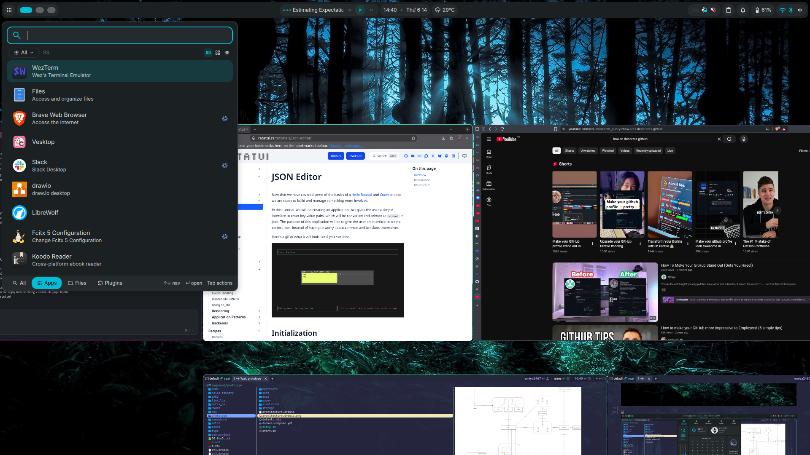
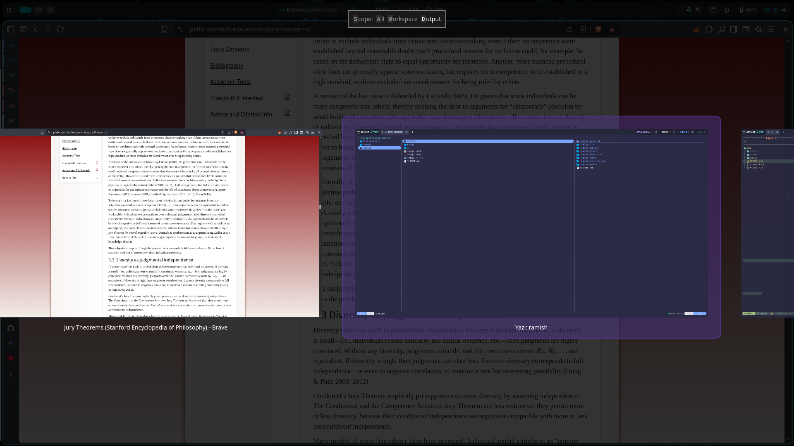
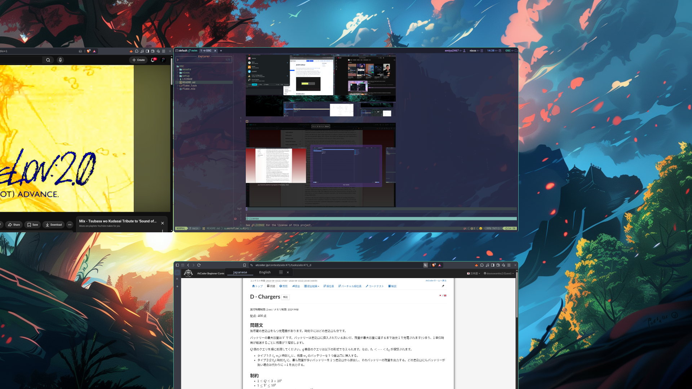

# NixOS Configuration

A modular and reusable configuration for [NixOS](https://nixos.org/), designed to manage the operating system and user environment declaratively.

The project separates **machine-specific configuration**, **system configuration**, **user configuration**, and **shared setup** into independent layers.

The main goal is to make the configuration easier to maintain, reuse, extend, and migrate between machines.

______________________________________________________________________

# Design Principles

```mermaid
mindmap
  root((NixOS Configuration))
    Declarative
      Configuration as code
      Desired system state
    Modular
      Independent modules
      Separation of concerns
    Reusable
      Shared configuration
      Multiple machines
    Reproducible
      Version control
      Rebuildable environment
```

# Workflow

## Neovim

## Niri

## 

# License

See [`LICENSE`](LICENSE) for the license of this project.
